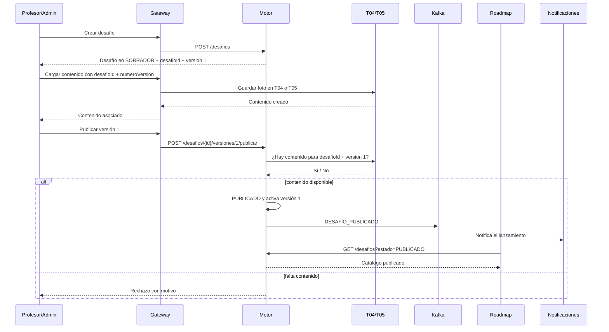
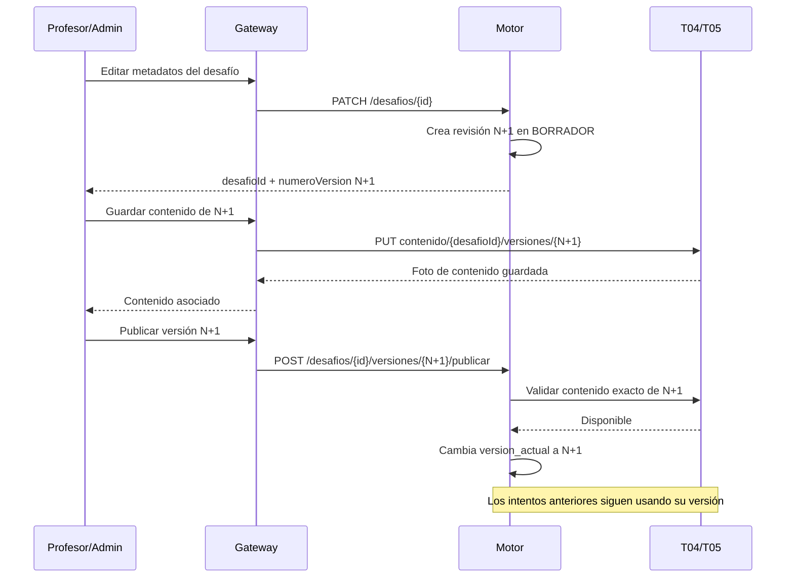
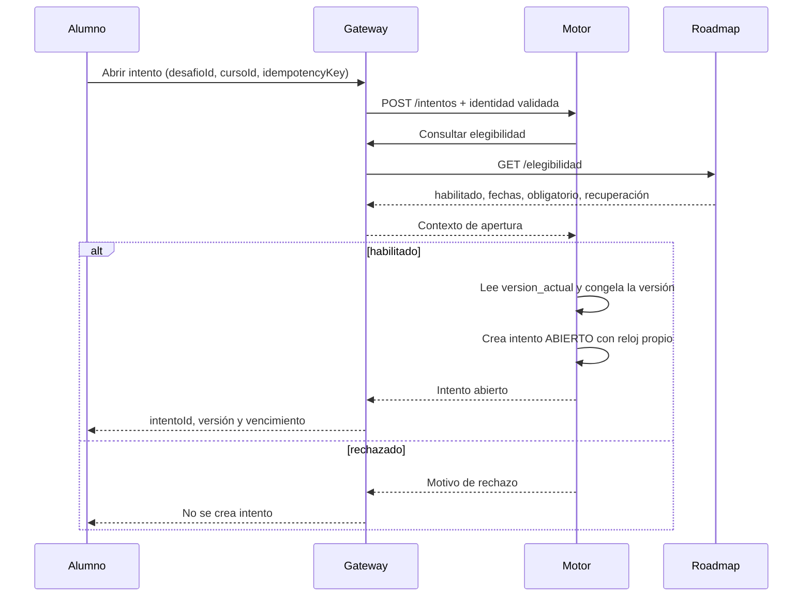
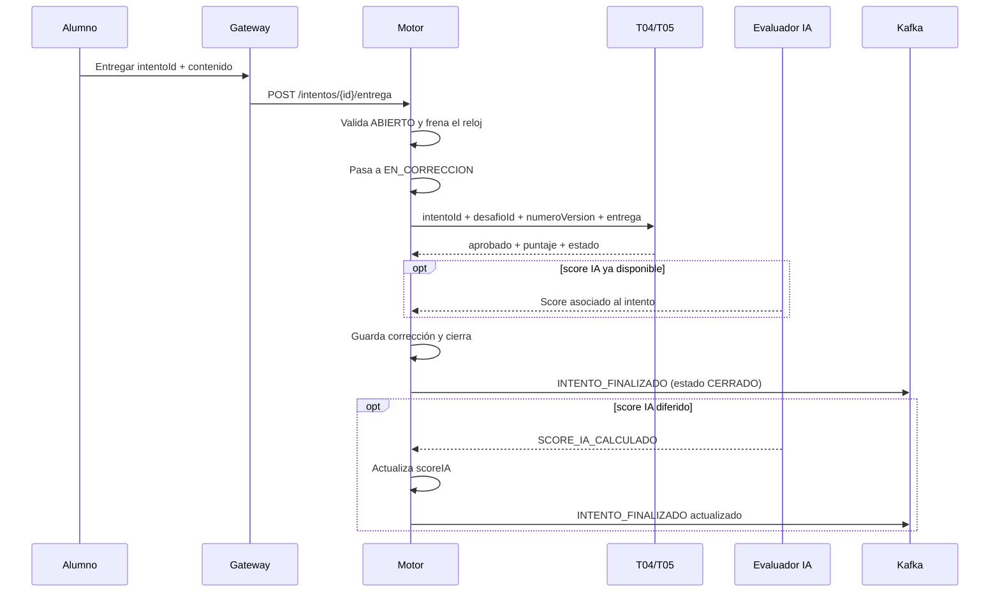
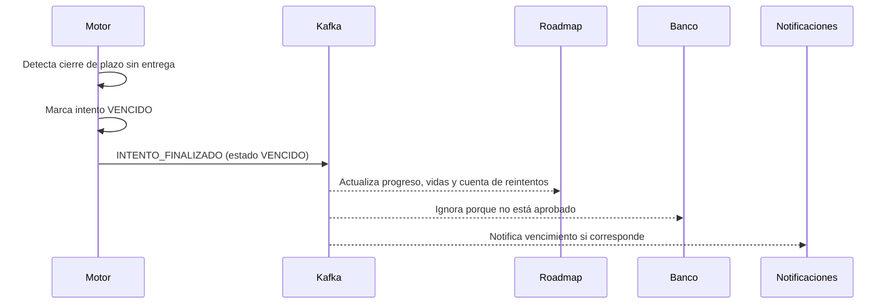
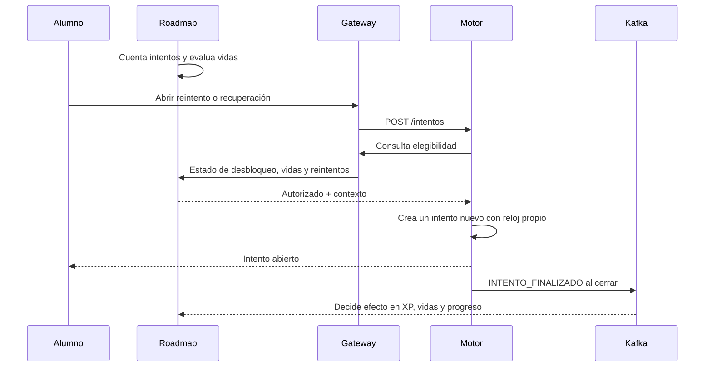
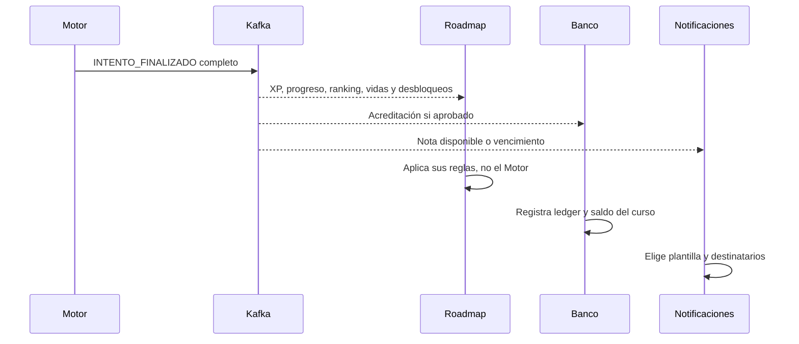

# Flujos de integración del Motor de desafíos

Este documento define los recorridos completos que cruzan el Motor y el contrato mínimo con cada grupo. El detalle de rutas, payloads y errores está en [`contratos.md`](contratos.md). La regla de lectura es simple:

- **Entrada al Motor**: un grupo nos pide una decisión o nos entrega un dato que necesitamos para cerrar un intento.
- **Salida del Motor**: el Motor informa un hecho propio o expone una consulta que otro grupo necesita.
- **Dato ajeno**: se consulta o se replica en el evento; no se convierte en una segunda fuente de verdad.

## Mapa de dependencias

| Grupo | Hacia el Motor | Desde el Motor | Canal | Estado del contrato |
|---|---|---|---|---|
| Gateway / Identidad (T01) | Token validado y contexto de usuario en cada solicitud | Respuestas REST del Motor | REST, siempre por Gateway | Definido |
| Cursos y Matrícula (T02) | No hay llamada directa en el MVP | No hay evento directo | Indirecto a través de Roadmap | Definido |
| Roadmap y Progreso (T10) | Elegibilidad para abrir o reintentar; fechas y obligatoriedad | Desafíos publicados por GET; resultado de cada intento por evento | REST sincrónico + Kafka | Definido |
| Teóricos (T04) | Confirmación de contenido; corrección de entregas teóricas | Entrega con respuestas y versión | REST sincrónico por Gateway | Definido |
| Prácticos (T05) | Confirmación de contenido; corrección de entregas prácticas | Entrega, referencia y versión | REST sincrónico por Gateway | Definido |
| Evaluador IA (T07) | Score de uso de IA calculado o diferido | Identidad del intento y versión para asociar la evaluación | Evento; mecanismo exacto por confirmar | Parcial |
| Banco (T08) | No hay llamada directa | Resultado aprobado, obligatoriedad y curso | Kafka | Definido |
| Mercado (T09) | No hay llamada directa | Ninguna | Sin integración | Definido |
| Social y Notificaciones (T11) | No hay respuesta de negocio | Intento finalizado y desafío publicado | Kafka | Definido |
| Backoffice (T12) | No hay llamada directa | Ninguna en el MVP | Sin integración | Definido |
| Sandbox / Runtime (T06) | No hay llamada directa | Ninguna | T05 media la relación | Definido |

El Gateway autentica y propaga el token; no decide si el alumno puede abrir un desafío. Esa decisión pertenece a Roadmap. Ningún microservicio accede directamente a otro: toda llamada sincrónica vuelve a pasar por el Gateway.

## Contratos que necesitamos de otros grupos

### Roadmap: autorización y contexto de apertura

Antes de crear un intento, el Motor necesita una respuesta de elegibilidad para la combinación alumno, desafío y curso. La respuesta debe incluir:

- habilitación para abrir;
- motivo de rechazo, si corresponde;
- estado de desbloqueo;
- fechas de apertura y cierre que el Motor usará para puntualidad y vencimiento;
- si el desafío es obligatorio;
- contexto de recuperación, si aplica;
- información necesaria para que Roadmap cuente reintentos y vidas, sin que el Motor los modifique.

El Motor no guarda la asignación, el roadmap, la pertenencia del alumno ni el saldo de vidas. Replica únicamente `cursoId`, `obligatorio` y las marcas necesarias en el intento y en sus eventos.

### Teórico y Práctico: contenido y corrección

Al publicar un desafío, el Motor consulta al servicio correspondiente según `tipo`:

- `TEORICO` consulta a T04;
- `PRACTICO` consulta a T05.

Sin contenido cargado, el desafío permanece en borrador. Al entregar, el Motor envía el `intentoId`, `desafioId`, `numeroVersion`, alumno, curso y entrega. El corrector responde con `aprobado`, `puntaje` y estado de corrección. El Motor no corrige, no calcula puntaje y no guarda preguntas, código ni casos de prueba.

El corrector debe usar la versión recibida. No puede consultar la versión vigente del catálogo, porque un profesor puede editar el desafío mientras un intento está abierto.

### Evaluador IA: score asociado al intento

El score de uso de IA es propiedad de T07. El Motor solo necesita recibirlo asociado a `intentoId` y guardarlo sin recalcularlo. Puede llegar:

1. antes del cierre, para incluirlo en el primer resultado;
2. después del cierre, como cálculo diferido.

En el segundo caso, el Motor actualiza el intento y republica `INTENTO_FINALIZADO` con el mismo `intentoId` y el score actualizado. Queda por confirmar con T07 el nombre del evento, el topic y si el contrato incluye `rubricVersion` y justificación.

## Qué necesitan los otros grupos de nosotros

### Roadmap y Progreso

Roadmap necesita dos cosas distintas:

1. consultar los desafíos publicados para armar o mostrar un roadmap;
2. consumir el resultado de cada intento para calcular XP, vidas, progreso, ranking y desbloqueos.

El Motor no publica un evento de "reintentos agotados". Roadmap lleva la cuenta usando `desafioId`, `alumnoId`, `cursoId`, resultado y la configuración de reintentos del desafío.

### Banco

Banco necesita `INTENTO_FINALIZADO` para acreditar monedas cuando el intento está aprobado. El evento incluye `cursoId` y `obligatorio`, porque las monedas pertenecen al curso y el monto depende de reglas de Banco. El Motor no envía ítems, multiplicadores ni saldos.

### Social y Notificaciones

Notificaciones necesita los hechos `DESAFIO_PUBLICADO` e `INTENTO_FINALIZADO` para decidir si muestra una notificación y qué plantilla usa. El Motor no compone el mensaje final ni decide destinatarios. La nota disponible se deriva del intento finalizado; no existe un evento separado.

### Teórico y Práctico

Los correctores necesitan la referencia estable del desafío y la versión congelada para recuperar o validar el contenido correspondiente. También necesitan la entrega y el contexto mínimo del intento para devolver un veredicto idempotente.

### Evaluador IA

T07 necesita la referencia del intento y los datos de la interacción de IA que haya registrado el servicio correspondiente. El Motor no debe recibir ni persistir la transcripción si no es necesaria para el resultado; solo conserva el score asociado al intento.

## Flujos completos

### 1. Publicar un desafío y dejarlo disponible

Crear el desafío y cargar su contenido son pasos separados: T03 entrega el `desafioId` y el `numeroVersion`, y el autor usa ambos identificadores para crear las preguntas teóricas o la consigna y los tests prácticos en T04/T05. La publicación valida que exista esa foto exacta antes de entrar al camino de apertura de alumnos. Roadmap no necesita suscribirse: obtiene el catálogo mediante GET cuando arma o consulta el roadmap.

### 2. Editar y sincronizar una versión publicada

Una edición no reemplaza la versión activa en el medio del proceso. Primero se crea una revisión nueva, luego se carga el contenido correspondiente y recién al publicar se mueve `version_actual`.

Si falla la carga, la revisión queda en borrador y la versión publicada anterior continúa activa. Si cambia el contenido evaluable, también debe abrirse una revisión nueva en T03; T04/T05 no modifica una foto ya publicada.

### 3. Abrir un intento autorizado

La clave de idempotencia devuelve el intento existente ante un reintento de red. Si Roadmap no autoriza, el Motor no adivina permisos ni crea un intento parcial.

### 4. Entregar y corregir un intento teórico o práctico

La demora de T04, T05 o T07 no consume tiempo del alumno. Cerrar es idempotente: una corrección repetida para un intento ya cerrado no duplica el resultado.

### 5. Vencer un intento sin entrega

El Motor marca el hecho; Roadmap decide si el vencimiento afecta vidas, XP o desbloqueos según sus reglas. No hay un evento adicional de "agotamiento".

### 6. Reintentar y recuperar una vida

Un desafío de recuperación es un desafío normal con `esRecuperacion=true`. Roadmap elige la pool, habilita el intento cuando corresponde y acredita la vida al aprobar. El Motor solo registra y publica el resultado.

### 7. Resultado, economía y notificaciones

El payload incluye `intentoId`, `desafioId`, `numeroVersion`, `dificultad`, `alumnoId`, `cursoId`, `obligatorio`, `estado`, `aprobado`, `puntaje`, `scoreIA`, `tiempoSegundos` y `puntualidad`. `dificultad` viaja porque Roadmap la usa para aplicar sus reglas de XP; el monto no lo calcula el Motor.

## Flujos que no cruzan el Motor

- T02 valida pertenencia y administra el ciclo de vida del curso; Roadmap usa ese contexto para decidir elegibilidad.
- T05 media la comunicación con T06 Sandbox; el Motor recibe el resultado práctico, no ejecuciones ni artefactos.
- T09 administra ítems e inventario. El Motor no valida, reserva ni consume ítems.
- T12 administra parámetros globales. Roadmap y Banco aplican XP, monedas y vidas; el Motor no calcula esos valores.
- T01 autentica. La autorización de negocio para abrir un desafío se resuelve con Roadmap.

## Puntos a cerrar con los otros grupos

1. **T07**: nombre del evento de score, topic, esquema de `rubricVersion`, justificación y política de republicación.
2. **T04/T05**: endpoints exactos, timeout, estados de corrección y contrato de idempotencia por `intentoId`.
3. **T04 / Encuestas**: confirmar si la encuesta bloquea la revelación de resultados y quién expone la confirmación. No se agrega una dependencia al Motor hasta cerrar ese contrato.
4. **Roadmap**: semántica exacta de fechas, ventana de entrega tardía y efecto de un vencimiento sobre vidas y XP.
5. **Todos los consumidores**: topic final, clave de partición, versión del sobre, reintentos y aplicación idempotente por `intentoId`.
