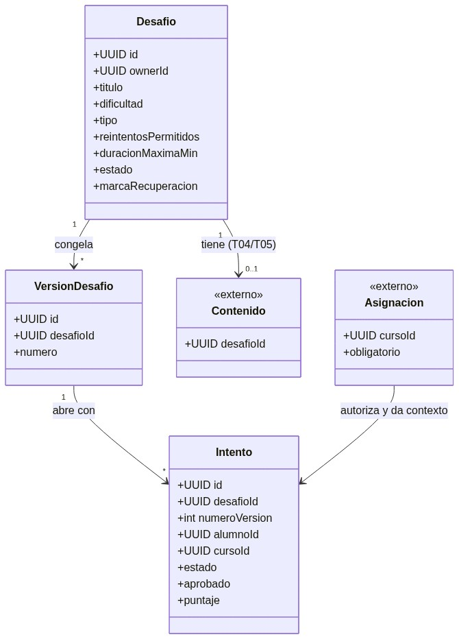
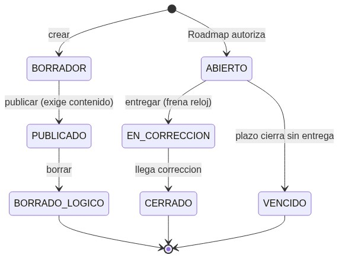
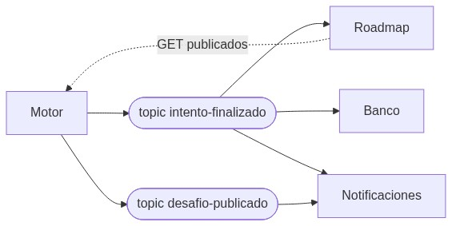

# Modelo de dominio

Conceptos del Motor y cómo se relacionan. Definiciones de una línea en `../CONTEXT.md`.

Cuatro vistas, una por tema. Lo marcado «externo» vive en otro servicio y las flechas dicen qué nos manda cada uno. Corrección y score van embebidos en el intento porque llegan decididos de afuera y no tienen id propio. Fuentes Mermaid en `diagramas/`.

## Núcleo

## Estados

## Eventos

Detalle de sobre y payloads en `eventos.md`.

## Desafío

Plantilla reutilizable. Trae título, descripción, dificultad (BASIC, MEDIUM, ADVANCED), tipo (PRACTICO o TEORICO, que define quién corrige), tope de reintentos, duración máxima del intento y marca de recuperación. Vive en borrador o publicado. Publicar exige contenido cargado en el corrector según el tipo, y solo lo publicado se asigna. El borrado es lógico: oculta del catálogo y conserva el historial. Cada profesor ve los suyos (catálogo propio), el admin ve todos (catálogo global). Solo ADMIN o PROFESOR crean desafíos, el alumno nunca.

La `descripcion` de T03 es el resumen general del catálogo. La consigna detallada, las preguntas, respuestas, código y casos de prueba pertenecen al contenido externo de T04/T05 y se crean después usando `desafioId`.

## Versión del desafío

Cada edición, hasta un typo o un cambio en el contenido evaluable, crea una revisión nueva con número creciente asignado por T03. La revisión queda en borrador mientras T04/T05 guarda su contenido con la misma pareja `desafioId` + `numeroVersion`. Solo al publicar se convierte en la versión vigente. El intento guarda con qué foto abrió y cierra con esa, aunque el profesor edite en el medio. El número viaja en cada entrega para que el corrector congele su contenido también.

## Intento

Apertura de un desafío por un alumno en un curso. Guarda inicio, entrega, tiempo en segundos, estado y puntualidad, más el contexto replicado (curso, obligatorio). Pasa por abierto, en corrección, cerrado o vencido. El reloj corre solo en abierto: se frena al entregar y la demora del corrector no cuenta. Cada reintento es un intento nuevo con reloj propio. Vencido es plazo cerrado sin entrega: se publica igual y Roadmap decide el efecto.

## Corrección y score IA

La corrección (aprobado más puntaje) la decide Teórico o Práctico según el tipo. El score de uso de IA lo decide el evaluador y a veces llega después que la corrección. El Motor guarda ambos tal cual, sin mezclarlos ni calcular nada encima. Con esos datos más el tiempo y el contexto, el intento cerrado forma su resultado y se publica.

## Ítems

No nos tocan. Viven en Mercado con estados activo e inactivo, y cada consumidor consulta y consume al aplicar. Detalle en `adr/0007-items-referencia-validada.md`.

## Lo referenciado

Asignación (orden, fechas, obligatoriedad) de Roadmap. Contenido teórico de T04 y práctico de T05: la referencia vive del otro lado, ellos guardan nuestro desafioId y nosotros nada de ellos. Por eso el Desafío nace primero acá. XP, monedas y vidas de Roadmap y Banco: el Motor solo publica los hechos que los disparan.

## Invariantes

- Sin elegibilidad de Roadmap no se abre.
- Borrador no se asigna, borrado no se asigna ni se edita.
- Un intento apunta a una sola versión y no la cambia.
- Cerrado y vencido son finales: no aceptan entregas ni ediciones.
