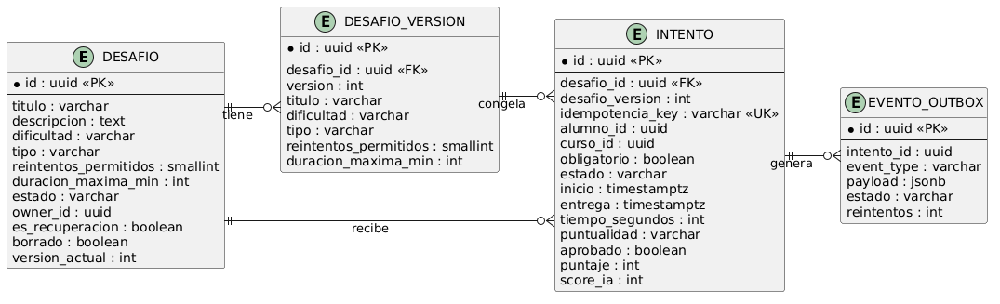
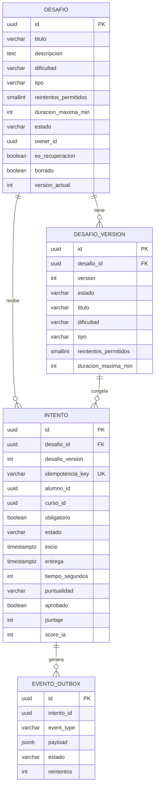

# Modelo de persistencia

Tres tablas en Postgres, base exclusiva del Motor. La corrección va embebida en el intento porque es 1 a 1 y llega decidida de afuera. Nada de esta base se comparte: quien necesita datos los pide por API o los lee de eventos.

## Tablas

Desafío guarda la plantilla y su estado actual: datos, dificultad y tipo como texto, tope de reintentos de 0 a 3, duración máxima en minutos (null es sin límite), estado borrador o publicado, dueño para el catálogo propio, marca de recuperación y flag de borrado. `version_actual` apunta a la foto vigente.

Versión guarda una foto por edición con número creciente y único por desafío. Una revisión nueva nace en `BORRADOR`; al publicar pasa a ser `PUBLICADA` y `version_actual` se mueve en la misma operación. Las versiones publicadas anteriores solo crecen, nunca se editan ni se borran: son el historial de reglas con el que abrió cada intento.

T04 y T05 mantienen el contenido fuera de esta base, pero deben guardar su propia foto con la clave `(desafio_id, version)`. T03 asigna el número; el corrector no genera otro contador para la integración. Un intento siempre envía la pareja `desafioId` + `numeroVersion` para recuperar el contenido exacto.

Intento guarda todo lo de una apertura: a qué foto apunta, quién y en qué curso, contexto replicado (obligatorio), marcas de tiempo, estado, puntualidad y veredicto (aprobado, puntaje, score IA). Corrección y score pueden llegar nulos hasta que aparecen: un intento en corrección todavía no tiene veredicto. Outbox guarda tipo, payload completo, estado (pendiente/enviado/error) y reintentos en la misma transacción que cierra el intento, y el relay publica y marca enviado. El estado lo necesita el relay para levantar pendientes, y el tope de reintentos evita que un evento envenenado gire para siempre. Apertura trae clave del llamante para no duplicar ante reintentos de red.

## Por qué así

- Versión en tabla aparte: los intentos abiertos apuntan a su foto y la edición no los toca. `adr/0004-intentos-conservan-version.md`
- Versión maestra en T03: T04/T05 guardan el contenido con la misma pareja `(desafio_id, version)` y no activan una revisión por separado.
- Contexto replicado en el intento: el evento sale completo sin volver a preguntar. `adr/0001-no-asignacion-storage.md`
- Corrección embebida en vez de tabla propia: es 1 a 1, llega decidida y nunca se edita. Tabla aparte sumaría un join por lectura sin beneficio.
- Borrado con flag, nunca DELETE: el historial académico no se borra.
- Contenido sin tabla: preguntas y casos viven en T04 y T05 atados por desafioId, acá no se persiste nada de eso.
- Ítems afuera: Mercado posee activo e inactivo por alumno, los consumidores consultan y consumen. Acá no hay tabla ni columna de ítems.
- Enums como texto (`BASIC`, `ABIERTO`, `TARDIA`): se leen en la base sin diccionario y el cambio de valores no renumera nada.

## Índices y reglas

- `intento(alumno_id, desafio_id)`: historial de un alumno en un desafío, lo más consultado.
- `intento(curso_id, estado)`: pendientes, en corrección y vencidos por curso.
- `desafio(owner_id, borrado, estado)`: catálogo propio y listado de publicados.
- `evento_outbox(estado, id)`: el relay levanta pendientes en orden.
- `desafio_version(desafio_id, version)` única: no hay dos fotos con el mismo número.
- Una sola revisión en borrador por desafío: evita que dos contenidos compitan por ser la próxima versión vigente.
- Checks: reintentos entre 0 y 3, entrega posterior a inicio, tiempo no negativo, veredicto solo si está cerrado.

## Notas JPA

Enums con `@Enumerated(STRING)`, borrado lógico con flag más filtro por defecto en repositorio, `inicio` con hora del servidor al abrir. La foto de versión se copia al abrir dentro de la misma transacción que crea el intento: o sale todo junto o no sale nada.
